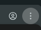
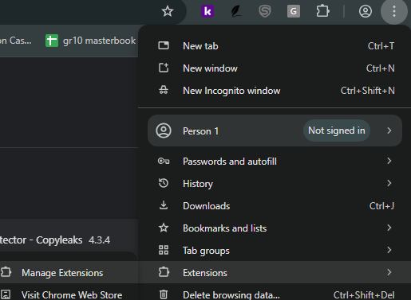
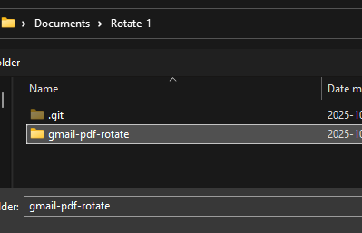
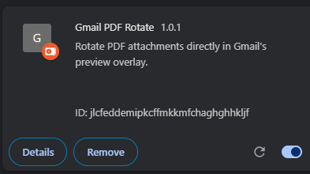

This chrome Extension Lets you rotate the PDF in the PDF Viewer of Gmail.

Use Case: Do you ever get PDFs that are scanned and are emailed to you rotated, so you have to rotate your head 90 degrees to read it? With this extension, those days of cervical spondylosis are over! You can now rotate PDFS in the gmail previewer to the correct orientation. No more neck pains. 

Steps to install:
1. Download the Above Repository to your Documents Folder
2. Go to Chrome and click the three little dots on the top-right of your screen: 

3. Go to Extensions and Click 'manage Extensions' 

4. On the Top -Right Hand side enable Developer Mode 

5. You can now Load Unpacked Extensions: 

6. Find the Folder you downloaded, and select the gmail-pdf-rotate Folder 

7. Make sure the chrome extension is enabled 

8. Try it out in Gmail! Go to an email containing a PDF, and you will see this rotate button appear on the top right

